# FinOS Agent — Architecture Diagram

This document describes the full application architecture. The diagram is in Mermaid format; render it in GitHub, VS Code (Mermaid extension), or any Mermaid-capable viewer.

## Mermaid Diagram

```mermaid
flowchart TB
  subgraph Users["👤 Users"]
    Browser["Browser (Next.js Frontend)"]
  end

  subgraph Frontend["Frontend (Next.js :3000)"]
    Pages["App Pages: /, /diagnostics, /login, /register, /auditor, /consolidation, /genui"]
    Components["Components: CFO Dashboard, Agent HUD, Thought Stream, Upload, HITL Banner, Consolidation, GenUI Chat"]
    Lib["Lib: apiClient, auth, ingest-types, audit-log"]
  end

  subgraph NodeAPI["Node API - FinOS Agent (Express :3001)"]
    Auth["Auth: JWT, optionalAuth, requireAuth, attachTenantPool, requireTenantContext"]

    subgraph Routes["API Routes"]
      TB["/api/trial-balance (ingest, parser, statements)"]
      Supervisor["/api/supervisor (chat, chat-verified, session/:id/trace, conflicts)"]
      HITL["/api/hitl (staging, webhook)"]
      CFA["/api/cfa (audit, liquidity, DCF, question, regression)"]
      Justification["/api/justification (chat, audit-defense/export)"]
      Orchestrator["/api/orchestrator (prepare-q4, intent, lead-partner)"]
      CFAAgent["/api/agents/cfa (analyze)"]
      CFODash["/api/cfo-dashboard (narrative, kpis, variance, scenario, board-deck)"]
      Audit["/api/audit (binder, reconciliation, todos, DRL, sampling, prior-period, GAAP, auditor, forensics, PBC, engagements, artifacts)"]
      KB["/api/knowledge-base (tier1, search, invoice-consistency)"]
      VectorStore["/api/vector-store (ingest, query, precedent)"]
      Ingestion["/api/ingestion (agent)"]
      Memory["/api/memory"]
      Close["/api/close (je-suggestions, checklist, period-lock, audit-log, segregation, task-assign)"]
      Pipelines["/api/pipelines (bank, ap/ar-aging, payroll, bank-rec, cash-position)"]
      Forecasting["/api/forecasting (13-week-cash, quarterly-annual)"]
      Capital["/api/capital (project-metrics, portfolio)"]
      Enterprise["/api/enterprise (QoE, covenants, tax, filing-calendar, statutory)"]
      Budget["/api/budget (version, reforecast, driver-based)"]
      Entities["/api/entities (consolidation, fx-translation)"]
      Intercompany["/api/intercompany"]
      DataQuality["/api/data-quality"]
      Approvals["/api/approvals"]
      Catalog["/api/catalog"]
      Reporting["/api/reporting (pack, commentary)"]
      Access["/api/access (dashboards, alerts, usage-log)"]
      AccountingIntegration["/api/accounting-integration"]
      ARAP["/api/ar-ap-workflows"]
      InvoiceToBooks["/api/invoice-to-books"]
      BankFeed["/api/bank-feed-matching"]
      RevenueRecognition["/api/revenue-recognition"]
      Onboarding["/api/onboarding"]
      Tenants["/api/tenants"]
      StockComp["/api/stock-comp"]
      DeferredTax["/api/deferred-tax"]
      Impairment["/api/impairment"]
      Segments["/api/segments"]
      Valuation["/api/valuation (dcf, comps, precedent, lbo)"]
      Consolidation["/api/consolidation"]
      Statutory["/api/statutory"]
      Acquisitions["/api/acquisitions"]
      EquityInvestments["/api/equity-investments"]
      Portfolios["/api/portfolios"]
      Leases["/api/leases"]
      FixedAssets["/api/fixed-assets"]
      EPS["/api/eps"]
      FX["/api/fx"]
      Export["/api/export (pdf, csv)"]
      CPA["/api/cpa (optional)"]
    end

    subgraph Services["Core Services"]
      UnifiedOrchestrator["unified_orchestrator (inferTaskStrategy, runUnifiedSupervisor)"]
      ResultGenerator["result_generator (runResultPipeline: CPA→CFA→Supervisor memo)"]
      Persistence["persistence_service (sessions, reasoning_logs, staging, snapshot)"]
      SupervisorAgent["agents/Supervisor (ReAct loop, Anthropic/OpenAI/Mistral)"]
      AuditorAgent["auditor_agent (Skeptic, Discussion)"]
      TrialBalance["trial-balance (parser, ingest, statements)"]
      FinancialStatements["financialStatements (buildValidatedStatements, integrity gate)"]
      IntegrityGate["integrity_gate_service"]
      HITLOrchestrator["hitl_orchestrator (submitToStaging, HumanApproved/Rejected)"]
      PlanExecuteVerify["planExecuteVerify"]
      PolicyMemory["memory/policy_memory"]
      SemanticMemory["memory/semantic_memory"]
      RiskContext["risk_context_store"]
    end

    subgraph Agents["Agents & Tools"]
      SupervisorCore["Supervisor (runSupervisor)"]
      CPABrain["CPA Brain (step1CPA, gap analysis)"]
      CFASpecialist["CFA (DuPont, Benchmark, Monte Carlo, Skepticism)"]
      Tools["Tools: buildFinancialStatements, forensicRescan, proposeTrialBalanceAdjustment, classifyAccount, computeRatios, leaseLiability, pythonBridge, semanticMemory, getDataGaps, portfolioPolicy, reconcileCPAwithCFA"]
    end

    subgraph LLM["LLM Provider"]
      Provider["provider (Anthropic / OpenAI / Mistral)"]
    end
  end

  subgraph PythonBackend["Python Backend (Flask :5000)"]
    FlaskApp["app.py"]
    AccountingEngine["accounting_engine"]
    AgentOrchestrator["agent_orchestrator"]
    Governance["governance (forensic_skeptic, integrity_gate, conflict_resolution)"]
    Compliance["compliance (citation_check, guardrail, knowledge_base)"]
    IngestionPy["ingestion (classification_agent, extractor, parser, pipeline)"]
    ExportPy["export (pdf, excel, csv, report_generator)"]
    ConsolidationPy["consolidation (eliminations, rollup, missing_ic_agent)"]
    TaxPy["tax (fx_engine, nexus_checker, tax_provisioning)"]
    ParserPy["parser (engine, ocr_engine, column_cleaner)"]
    PythonExecutor["python_executor"]
  end

  subgraph Connectors["Connectors (Python)"]
    ERP["connectors: erp_adapters, erp_bridge, erp_sync, mcp_erp_server, oauth_scopes"]
  end

  subgraph MCPServer["MCP Server (Python)"]
    MCP["mcp_server: server, budget_store, draft_webhook, rbac, tool_logger, webhook_server"]
  end

  subgraph Data["Data Layer"]
    ControlDB["Control DB (Postgres) — tenants, users, identity"]
    TenantDB["Tenant DB (Postgres / BYOD) — business data, sessions, reasoning_logs, staging, migrations 003–062"]
  end

  subgraph External["External"]
    Anthropic["Anthropic API"]
    OpenAI["OpenAI API"]
    Mistral["Mistral API"]
  end

  Browser --> Frontend
  Frontend --> NodeAPI
  NodeAPI --> Auth
  Auth --> Routes
  Routes --> Services
  Services --> UnifiedOrchestrator
  UnifiedOrchestrator --> ResultGenerator
  UnifiedOrchestrator --> SupervisorAgent
  SupervisorAgent --> Tools
  SupervisorAgent --> Provider
  Provider --> Anthropic
  Provider --> OpenAI
  Provider --> Mistral
  Services --> Persistence
  Persistence --> ControlDB
  Persistence --> TenantDB
  NodeAPI --> PythonBackend
  PythonBackend --> Connectors
  NodeAPI --> MCPServer
  ResultGenerator --> FinancialStatements
  FinancialStatements --> IntegrityGate
  SupervisorAgent --> AuditorAgent
  HITLOrchestrator --> Persistence
  Routes --> HITLOrchestrator
```

## Layer Summary

| Layer | Contents |
|-------|----------|
| **Users** | Browser calling the Next.js app. |
| **Frontend** | Next.js (port 3000): app routes, UI components (diagnostics HUD, CFO dashboard, upload, thought stream, HITL, consolidation, GenUI), and lib (API client, auth, types). |
| **Node API** | Express (port 3001): auth (JWT, tenant, pool), all `/api/*` routes (trial-balance, supervisor, hitl, cfa, justification, orchestrator, cfo-dashboard, audit, close, pipelines, knowledge-base, vector-store, ingestion, memory, export, and domain routes for valuation, consolidation, leases, etc.), plus core services and agents. |
| **Core Services** | `unified_orchestrator` (strategy + runUnifiedSupervisor), `result_generator` (deterministic pipeline), `persistence_service` (sessions, reasoning_logs, staging, snapshot), Supervisor and Auditor agents, trial-balance/financialStatements/integrity gate, HITL orchestrator, plan-execute-verify, policy/semantic memory, risk context. |
| **Agents & Tools** | Supervisor (ReAct), CPA Brain, CFA specialist, and tools (e.g. buildFinancialStatements, forensicRescan, proposeTrialBalanceAdjustment, classifyAccount, pythonBridge, etc.). |
| **LLM** | Single provider abstraction used by Supervisor; backed by Anthropic, OpenAI, or Mistral. |
| **Python Backend** | Flask (port 5000): app, accounting engine, agent orchestrator, governance/compliance, ingestion, export, consolidation, tax, parser, python_executor. |
| **Connectors & MCP** | Python connectors (ERP adapters, bridge, sync, MCP ERP server, OAuth) and MCP server (budget, webhook, RBAC, tool logger). |
| **Data** | Control DB (tenants, users) and Tenant DB / BYOD (all business data, sessions, reasoning_logs, staging, migrations). |
| **External** | Anthropic, OpenAI, Mistral APIs. |

## Ports

- **3000** — Next.js frontend
- **3001** — FinOS Agent Node API (Express)
- **5000** — Python Flask backend

## Related Docs

- [BYOD_ARCHITECTURE.md](./BYOD_ARCHITECTURE.md) — Control vs tenant DB, BYOD
- [supervisor_agent.md](./supervisor_agent.md) — Supervisor ReAct loop
- [CPA_CFA_CAPABILITY.md](./CPA_CFA_CAPABILITY.md) — CPA/CFA specialist brains
